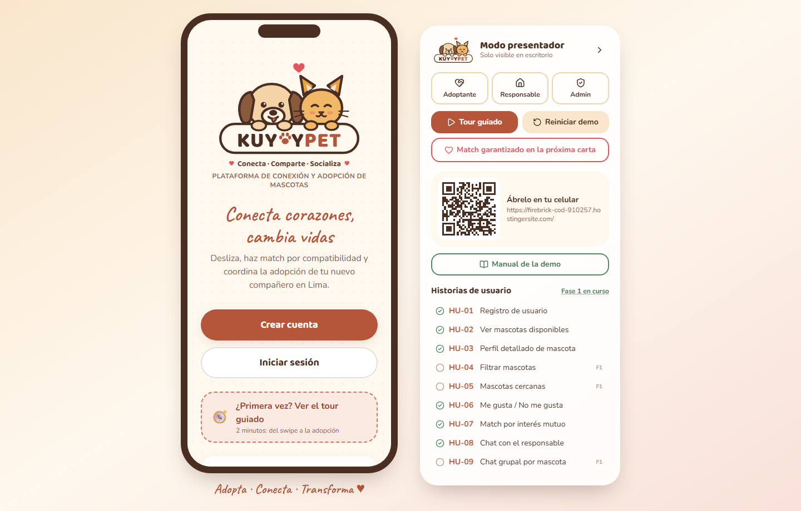
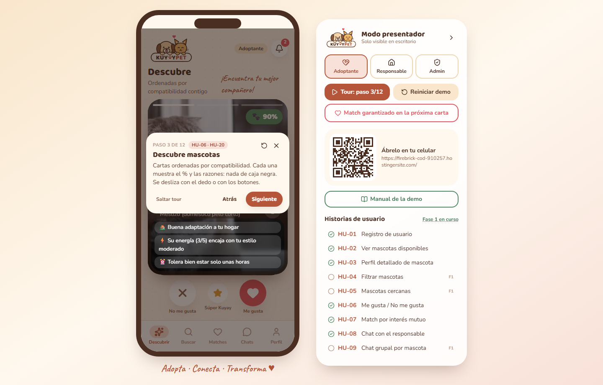
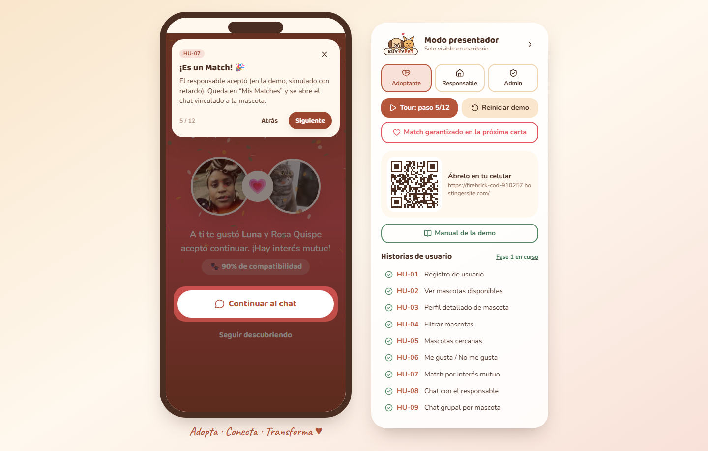
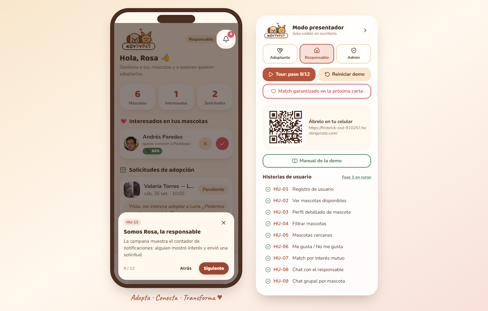
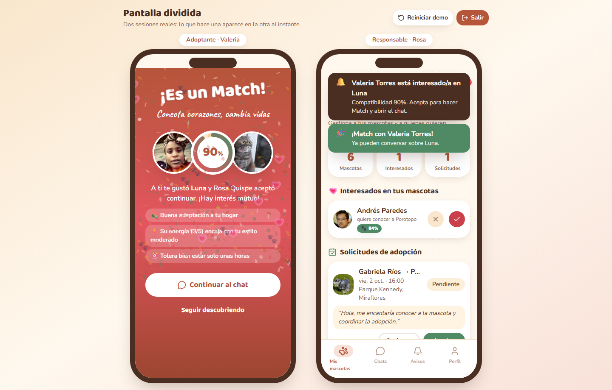

# Manual de la demo · KuyayPet

*Para el presentador. Ingeniería de Software · UPCH 2026-2.*

**Link principal:** https://firebrick-cod-910257.hostingersite.com/
**Espejo (plan B):** https://ichisieben.github.io/kuyaypet/
**Cuentas demo** (contraseña `kuyay2026`): `adoptante@kuyaypet.pe` (Valeria) · `responsable@kuyaypet.pe` (Rosa) · `admin@kuyaypet.pe`

---

## 1. Preparación antes de clase (5 min)

1. Abre el link principal en **Chrome de escritorio** y pon **pantalla completa (F11)**. A partir de 1024 px de ancho aparecen el **marco de celular** y el **panel de presentador** a la derecha.
2. En el panel pulsa **Reiniciar demo**: vuelven los datos semilla y se cierra la sesión.
3. **Prueba el QR** del panel con tu celular: debe abrir la misma app a pantalla completa. Esa es la invitación para que la clase la abra.
4. Deja el zoom del navegador en 100 %. Si el proyector es de baja resolución, prueba con 90 % (Ctrl −).
5. **Sin internet:** abre la app una vez con internet antes de clase. Es una PWA: queda en caché con fotos y fuentes incluidas. Si el aula no tiene red, recarga igual y funcionará desde la caché. Como respaldo extremo, usa las capturas de este manual.
6. **Teclado:** durante el tour, **→** avanza, **←** retrocede y **Esc** sale (y deja todo como estaba antes del tour).

---

## 2. Guion del tour (5–7 min)

Pulsa **Tour guiado** en el panel. El tour **guarda lo que tenías abierto**, carga los datos semilla y fija a **Luna** (la gata de Rosa) como primera carta. La tarjeta del tour dice “Paso N de 12” y nunca tapa lo que explica; el panel también muestra el paso.

- **Pasos de explicación:** pulsa **Siguiente** (o →).
- **Pasos de acción** (4, 5, 7, 10 y 11): la tarjeta te pide el gesto real (“Toca ♥ Me gusta en Luna”). Solo ese botón responde; el resto de la pantalla está bloqueado. Si prefieres no hacerlo, pulsa **Hazlo por mí**. Si pasan 30 s, la pista parpadea para recordártelo.
- **Si algo se sale del guion** (cambias de rol en el panel, navegas a mano), el tour vuelve solo al paso correcto y muestra “Volvimos al guion del tour ↺”.
- **Atrás** deshace también los datos de ese paso. **↺** (arriba) reinicia el tour. **Saltar tour**, **✕** o **Esc** salen y **restauran lo que tenías antes**.

| # | Qué pasa en pantalla | Qué digo (1–2 frases) | HU | ≈ tiempo |
|---|---|---|---|---|
| 1 | Pantalla de inicio con los botones de rol | “KuyayPet es un Tinder para adoptar: la información de adopción en Lima está dispersa; aquí se centraliza y se conecta por compatibilidad.” | HU-01 | 40 s |
| 2 | Cuestionario tipo Bumble | “Primero conocemos al adoptante: vivienda, horas que pasa fuera, actividad, niños, alergias. Una pregunta por pantalla.” | HU-20 | 40 s |
| 3 | Deck con Luna, % y razones | “Cada carta muestra el porcentaje y **por qué**: distancia, vivienda, energía. Nada de caja negra.” | HU-06, HU-20 | 40 s |
| 4 | Se resalta **Me gusta**: tócalo (o *Hazlo por mí*) | “Un like no es un Match: avisa al responsable. El Match solo ocurre con interés mutuo.” | HU-06 | 20 s |
| 5 | **¡Es un Match!**: anillo de compatibilidad, razones y confeti de huellas. Toca *Continuar al chat* | “Rosa aceptó. Aquí la aceptación está simulada; en la fase 2 la hace una persona real desde su celular.” | HU-07 | 30 s |
| 6 | Chat con Luna: se envía un mensaje y Rosa responde | “El chat queda vinculado a la mascota y se guarda el historial.” | HU-08 | 30 s |
| 7 | Formulario **Coordinar adopción**: toca *Enviar solicitud* | “Desde el chat propongo fecha y hora para conocer a Luna.” | HU-10 | 20 s |
| 8 | **¡Solicitud enviada!** con estado Pendiente | “Veo el estado: pendiente, aceptada o rechazada. Ahora cambiemos de lado.” | HU-10 | 15 s |
| 9 | Somos **Rosa**: se resalta la campana con el contador | “La responsable recibe la notificación al instante.” | HU-13 | 30 s |
| 10 | Rosa **acepta** la visita: toca *Aceptar* y confirma | “Acepta, y Valeria recibe la confirmación en el chat.” | HU-10, HU-13 | 20 s |
| 11 | **Admin** aprueba una publicación pendiente: toca *Aprobar* y confirma | “Toda mascota nueva pasa por moderación: así evitamos ventas encubiertas (Ley 30407).” | HU-24 | 30 s |
| 12 | Créditos del equipo | “Escaneen el QR y pruébenlo en su celular.” | — | 20 s |

---

## 3. Recorrido libre por rol

Cambia de rol con los tres botones del panel (**Adoptante · Responsable · Admin**). Al cambiar, entras directo con la cuenta demo de ese rol.

**Adoptante (Valeria)**
- **Descubrir:** desliza con el mouse o usa ✕ / ⭐ / ♥. El botón **Match garantizado en la próxima carta** del panel asegura que el siguiente like termine en Match.
- **Buscar:** grilla con **Filtros** (especie, raza, edad, sexo, tamaño; HU-04) y **Buscar por cercanía** (distrito o ubicación actual, radio en km, lista o mapa; HU-05).
- **Perfil de mascota:** fotos, “¿Por qué hacemos match?”, favoritos, **Unirme al chat de la mascota** (grupal, HU-09), **Reportar** y Coordinar (HU-03, HU-10).
- **Perfil:** Favoritos (HU-17), Historial de interés (HU-18), **Guía de adopción** con buscador (HU-14) y cerrar sesión (HU-21).
- **Login → ¿Olvidaste tu contraseña?:** el código llega a una **bandeja de correo simulada** (HU-15).

**Responsable (Rosa)**
- **Registrar** mascota en 3 pasos: datos, fotos con vista previa y etiquetas, e historia y salud (HU-11, HU-16). Queda **En revisión** hasta que el admin la aprueba.
- **Editar información** (HU-12) y **Marcar como adoptada** (HU-19) desde Mis publicaciones.
- Interesados con su % (aceptar = Match) y solicitudes de visita (aceptar o rechazar).
- **Avisos:** al tocar una notificación se abre el perfil del adoptante o el chat de esa solicitud (HU-13).

**Administrador**
- **Resumen:** KPIs contra las metas del caso de negocio (500 usuarios, 200 matches, 60 % activos) y publicaciones pendientes (HU-24).
- **Usuarios:** buscar, filtrar, editar y **desactivar o reactivar** (una cuenta desactivada no puede entrar; HU-22, HU-25).
- **Publicaciones:** revisar y editar todas (HU-23).
- **Reportes:** ocultar la publicación, desactivar la cuenta o descartar (HU-26).

**Pantalla dividida (escritorio):** en el panel, **Pantalla dividida: Adoptante | Responsable** muestra dos celulares con sesiones reales. El “Me gusta” de Valeria aparece al instante en el celular de Rosa, y cuando Rosa acepta, a Valeria le salta el Match. Es la mejor forma de explicar el **interés mutuo**. **Salir** vuelve a la vista normal.

---

## 4. Qué es simulado y cómo explicarlo

| Pregunta posible | Respuesta corta |
|---|---|
| ¿Dónde está la base de datos? | “En esta fase los datos viven en el navegador (localStorage), detrás de una capa de servicios. La fase 2 cambia esa capa por Supabase sin tocar las pantallas.” |
| ¿Quién acepta los likes? | “Responsables simulados con una probabilidad y un retardo; Rosa, la responsable demo, acepta a mano en el tour.” |
| ¿Cómo se sincronizan los dos celulares? | “Comparten la base de datos del navegador y se avisan con el evento `storage`. En la fase 2 ese canal será Supabase Realtime.” |
| ¿Y el chat? | “Los mensajes se guardan de verdad; las respuestas del responsable son plantillas. En la fase 2 será tiempo real.” |
| ¿Y el correo de recuperación? | “Simulado: se ve en una bandeja dentro de la app. Con backend se enviaría de verdad.” |
| ¿Login con Google? | “Selector simulado. Con un Client ID se usa Google Identity Services, pero sin backend no se puede verificar el token, por eso no lo activamos.” |
| ¿El % es confiable? | “Son pesos heurísticos y explicables. La fase 2 los calibra con adopciones reales.” |
| ¿Es seguro? | “Es un prototipo: las contraseñas demo están en el navegador. La fase 2 usa Supabase Auth con permisos por fila.” |

**Siguiente fase:** backend Supabase (auth, Postgres y chat en tiempo real), app Flutter y módulo Comunidad (paseos y playdates).

---

## 5. Plan B

1. **Algo raro en pantalla:** pulsa **Reiniciar demo** en el panel y vuelve a lanzar el tour.
2. **El tour se trabó:** pulsa **Esc** para salir y luego *Tour guiado* otra vez (siempre empieza desde cero).
3. **La página no responde:** recarga (F5). Los datos se conservan.
4. **Hostinger caído:** usa el espejo https://ichisieben.github.io/kuyaypet/
5. **Sin proyector ni internet:** muestra las capturas de este manual.

---

## 6. Trazabilidad HU → pantalla → tour

| HU | Pantalla (ruta) | Paso del tour | Estado |
|---|---|---|---|
| HU-01 Registro | `/registro`, `/login` | 1 | Lista |
| HU-02 Mascotas disponibles | `/buscar` | — | Lista |
| HU-03 Perfil de mascota | `/mascota/:id` | — | Lista |
| HU-04 Filtros | `/buscar` → Filtros | — | Lista |
| HU-05 Cercanía | `/buscar` → Buscar por cercanía | — | Lista |
| HU-06 Me gusta / No me gusta | `/descubrir` | 3–4 | Lista |
| HU-07 Match | overlay + `/matches` | 5 | Lista |
| HU-08 Chat | `/chats/:id` | 6 | Lista |
| HU-09 Chat grupal | perfil → Unirme al chat | — | Lista |
| HU-10 Coordinar adopción | `/coordinar/:id` | 7–8, 10 | Lista |
| HU-11 Registrar mascota | `/responsable/nueva` | — | Lista |
| HU-12 Editar mascota | `/responsable/editar/:id` | — | Lista |
| HU-13 Notificaciones | campana, `/notificaciones` | 9 | Lista |
| HU-14 Guía de adopción | `/guia` | — | Lista |
| HU-15 Recuperar contraseña | `/recuperar` | — | Lista (correo simulado) |
| HU-16 Fotos y etiquetas | `/responsable/nueva` (paso 2) | — | Lista |
| HU-17 Favoritos | `/favoritos` | — | Lista |
| HU-18 Historial | `/historial` | — | Lista |
| HU-19 Marcar adoptada | `/responsable` | — | Lista |
| HU-20 Compatibilidad | `/onboarding`, `/matches` | 2–3 | Lista |
| HU-21 Cerrar sesión | `/perfil` | — | Lista |
| HU-22 Gestionar usuarios | `/admin/usuarios` | — | Lista |
| HU-23 Revisar publicaciones | `/admin/publicaciones` | — | Lista |
| HU-24 Aprobar / rechazar | `/admin` | 11 | Lista |
| HU-25 Desactivar cuentas | `/admin/usuarios/:id` | — | Lista |
| HU-26 Reportes | `/admin/reportes`, perfil → Reportar | — | Lista |
